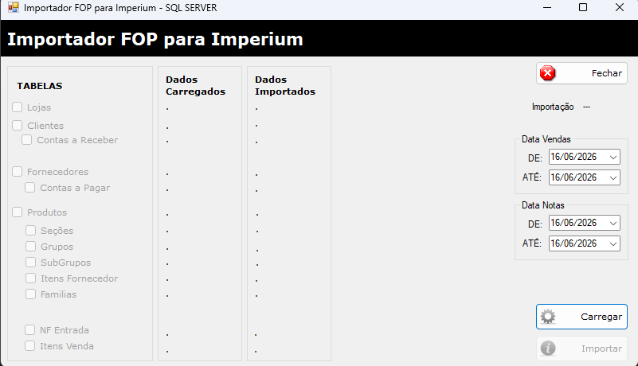
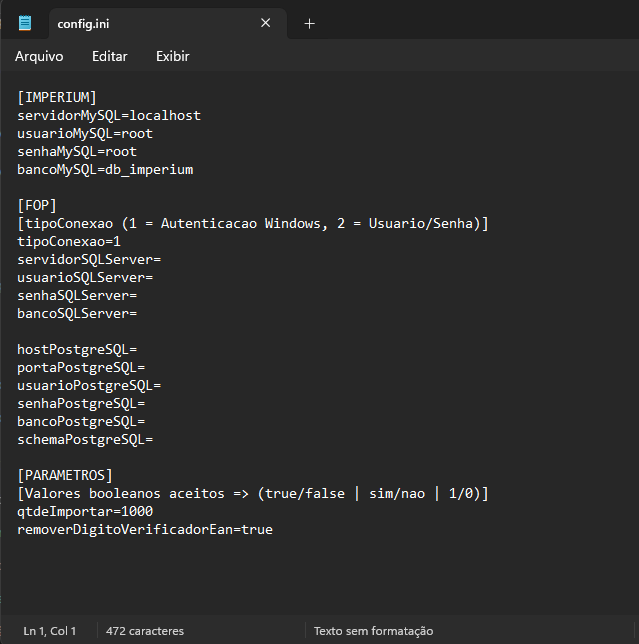

# Importador Fop/Imperium

Ferramenta desktop desenvolvida em Windows Forms para migração de dados entre bancos de dados relacionais, permitindo a importação de informações de SQL Server e PostgreSQL para MySQL.

## 📋 Sobre o Projeto

O Importador Fop/Imperium foi desenvolvido para simplificar processos de migração de dados entre diferentes ERPs, oferecendo uma interface gráfica para execução das importações.

### Principais Recursos

- Importação de dados do SQL Server para MySQL.
- Importação de dados do PostgreSQL para MySQL.
- Mapeamento de tabelas.
- Acompanhamento do progresso da importação.
- Registro de erros e inconsistências durante o processo.

## 🛠️ Tecnologias Utilizadas

- C#
- Windows Forms
- .NET Framework 4.6.1
- SQL Server
- PostgreSQL
- MySQL
- ADO.NET

## 📦 Requisitos

### Sistema Operacional

- Windows 7 ou superior

### Framework

- .NET Framework 4.6.1

### Bancos de Dados Suportados

#### Origem
- SQL Server
- PostgreSQL

#### Destino
- MySQL

## ⚙️ Configuração

### SQL Server

Informar:

- Servidor
- Banco de dados
- Usuário
- Senha

### PostgreSQL

Informar:

- Host
- Porta
- Schema
- Banco de dados
- Usuário
- Senha

### MySQL

Informar:

- Host
- Banco de dados
- Usuário
- Senha

## 🚀 Como Utilizar

1. Abra a aplicação, o sistema irá criar o arquivo config.ini na raiz.
2. Configure a conexão de origem.
3. Configure a conexão de destino (MySQL).
4. Selecione as tabelas que serão importadas.
5. Inicie o processo de migração.
6. Acompanhe o progresso pela interface.

## 🔄 Fluxo de Importação

```text
SQL Server
            \
             > MySQL
            /
PostgreSQL
```

## 📂 Estrutura do Projeto

```text
ImportadorFopImperium/
│
├── Enum/
│
├── Model/
│
├── FormPrincipal.cs
│
└── Program.cs
```

## 📸 Interface

### Tela Principal



### Configuração de Conexão



## ⚠️ Observações

- Recomenda-se realizar backup dos bancos antes de executar importações.
- Verifique compatibilidade entre os tipos de dados dos bancos envolvidos.
- Grandes volumes de dados podem aumentar significativamente o tempo de processamento.

## 🧪 Testes

Realizar testes de importação com:

- Pequenos volumes de dados.
- Bases com relacionamentos.
- Campos nulos.
- Caracteres especiais e acentuação.

## 👨‍💻 Autor

Fernando Ribeiro
